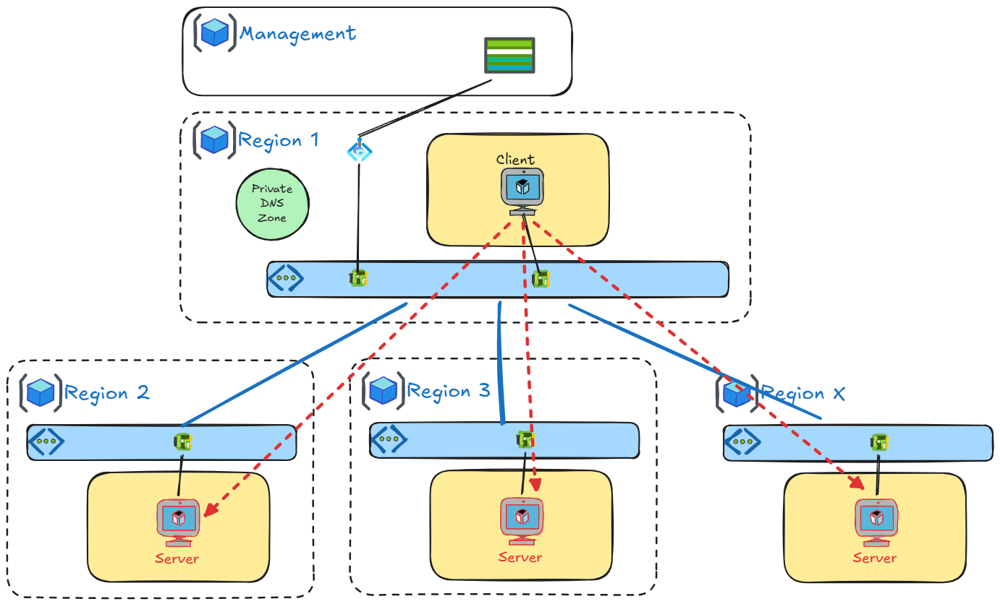

# Azure Region Span

> ⚠️ **Disclaimer**: This is a personal project and is not an official Microsoft tool. It is not supported or endorsed by Microsoft.

A tool for measuring and visualizing network latency between Azure regions.

🌐 **Live Instance**: [https://regionspan.azure.cloud63.fr/](https://regionspan.azure.cloud63.fr/)

## 📋 Description

This project allows you to:
- **Deploy a test infrastructure** across multiple Azure regions to measure inter-region network latency
- **Automatically collect** latency measurements between all configured regions
- **Visualize results** through an interactive dashboard with a world map

## 🏗️ Architecture



### Components

| Component | Description |
|-----------|-------------|
| **Server VMs** | Linux VMs running `qperf` listener, deployed in each target region |
| **Client VM** | Linux VM that runs latency tests against all servers |
| **VNet Peering** | Private network connectivity between VNets across regions |
| **Private DNS Zone** | Private DNS resolution (`<region>.region.local`) for servers |
| **Table Storage** | Storage for latency results |
| **Azure Functions** | API to retrieve latency data |
| **Static Web App** | Interactive visualization dashboard |

## 🚀 Deployment

### Prerequisites

- [Terraform](https://www.terraform.io/downloads) >= 1.0
- [Azure CLI](https://docs.microsoft.com/cli/azure/install-azure-cli)
- An Azure subscription with resource creation permissions

### Deployment Steps

This project has been designed to be used with GitHub Actions, but you can also deploy it manually using the following steps:

#### 1. Initial Setup

```bash
# Clone the repository
git clone https://github.com/vmisson/azure-region-bench.git
cd azure-region-bench

# Login to Azure
az login
az account set --subscription <SUBSCRIPTION_ID>

# Initialize Terraform
terraform init
```

#### 2. Deploy Base Infrastructure

First, deploy the shared infrastructure (Resource Group, central VNet, DNS zones):

```bash
terraform apply -var-file="tfvars/francecentral.tfvars" \
  -var="subscription_id=<SUBSCRIPTION_ID>" \
  -var="deploy_infra=true"
```

#### 3. Deploy Servers in Each Region

For each region where you want to measure latency:

```bash
# Example for East US
terraform apply -var-file="tfvars/eastus.tfvars" \
  -var="subscription_id=<SUBSCRIPTION_ID>" \
  -var="deploy_server=true"

# Example for West Europe
terraform apply -var-file="tfvars/westeurope.tfvars" \
  -var="subscription_id=<SUBSCRIPTION_ID>" \
  -var="deploy_server=true"
```

#### 4. Deploy the Test Client

```bash
terraform apply -var-file="tfvars/francecentral.tfvars" \
  -var="subscription_id=<SUBSCRIPTION_ID>" \
  -var="deploy_client=true"
```

### Available Regions

| Region | tfvars File |
|--------|-------------|
| Australia East | `australiaeast.tfvars` |
| Belgium Central | `belgiumcentral.tfvars` |
| Brazil South | `brazilsouth.tfvars` |
| Canada Central | `canadacentral.tfvars` |
| Central India | `centralindia.tfvars` |
| Central US | `centralus.tfvars` |
| Chile Central | `chilecentral.tfvars` |
| East Asia | `eastasia.tfvars` |
| East US | `eastus.tfvars` |
| East US 2 | `eastus2.tfvars` |
| France Central | `francecentral.tfvars` |
| Germany West Central | `germanywestcentral.tfvars` |
| Indonesia Central | `indonesiacentral.tfvars` |
| Israel Central | `israelcentral.tfvars` |
| Italy North | `italynorth.tfvars` |
| Japan East | `japaneast.tfvars` |
| Japan West | `japanwest.tfvars` |
| Korea Central | `koreacentral.tfvars` |
| Malaysia West | `malaysiawest.tfvars` |
| Mexico Central | `mexicocentral.tfvars` |
| New Zealand North | `newzealandnorth.tfvars` |
| North Europe | `northeurope.tfvars` |
| Norway East | `norwayeast.tfvars` |
| Poland Central | `polandcentral.tfvars` |
| Qatar Central | `qatarcentral.tfvars` |
| South Africa North | `southafricanorth.tfvars` |
| South Central US | `southcentralus.tfvars` |
| Southeast Asia | `southeastasia.tfvars` |
| Spain Central | `spaincentral.tfvars` |
| Sweden Central | `swedencentral.tfvars` |
| Switzerland North | `switzerlandnorth.tfvars` |
| UAE North | `uaenorth.tfvars` |
| UK South | `uksouth.tfvars` |
| West Europe | `westeurope.tfvars` |
| West US 2 | `westus2.tfvars` |
| West US 3 | `westus3.tfvars` |

## 🧪 Running Tests

Once the client is deployed, latency tests are automatically executed via the `netperf-test.sh` script:

```bash
# Connect to the client VM
ssh azureuser@<CLIENT_IP>

# Run tests manually
/usr/local/bin/netperf-test.sh
```

The script uses `qperf` to measure TCP latency to each server and sends the results to Azure Table Storage.

## 📊 Dashboard

The dashboard provides an interactive visualization of latency results.

### Features

- 🗺️ **Interactive Map**: Visualization of Azure regions on a world map
- 📊 **Real-time Data**: Retrieval of measurements from Azure Table Storage
- 🎨 **Color Coding**: Latencies colored by performance (green → red)
- 📋 **Sorted List**: Latencies displayed sorted by performance
- 📈 **Statistics**: Global metrics (number of regions, average latency, etc.)

### Dashboard Deployment

See the [dashboard README](./dashboard/README.md) for deployment instructions.

```bash
cd dashboard
./deploy.sh
```

## 📁 Project Structure

```
azure-region-bench/
├── main.tf                 # Main Terraform configuration
├── variables.tf            # Terraform variables
├── outputs.tf              # Terraform outputs
├── providers.tf            # Provider configuration
├── tfvars/                 # Variable files per region
│   ├── eastus.tfvars
│   ├── westeurope.tfvars
│   └── ...
├── modules/
│   ├── infra/              # Shared infrastructure (RG, VNet, DNS)
│   ├── server/             # qperf server VMs
│   ├── client/             # Test client VM
│   └── dashboard/          # Dashboard resources
└── dashboard/
    ├── api/                # Azure Functions API
    └── www/                # Static frontend
```

## 🔧 Terraform Variables

| Variable | Description | Default |
|----------|-------------|---------|
| `subscription_id` | Azure subscription ID | - |
| `location` | Azure deployment region | - |
| `size` | VM size | - |
| `index` | Instance index (for network addressing and rolling deployment) | `0` |
| `deploy_infra` | Deploy base infrastructure | `false` |
| `deploy_server` | Deploy a server | `false` |
| `deploy_client` | Deploy the test client | `false` |
| `storage_account_name` | Storage Account name | `sanetprdfrc002` |
| `storage_account_resource_group` | Storage Account resource group | `rg-net-prd-frc-001` |

## 📝 License

This project is licensed under the MIT License - see the [LICENSE](LICENSE) file for details.
